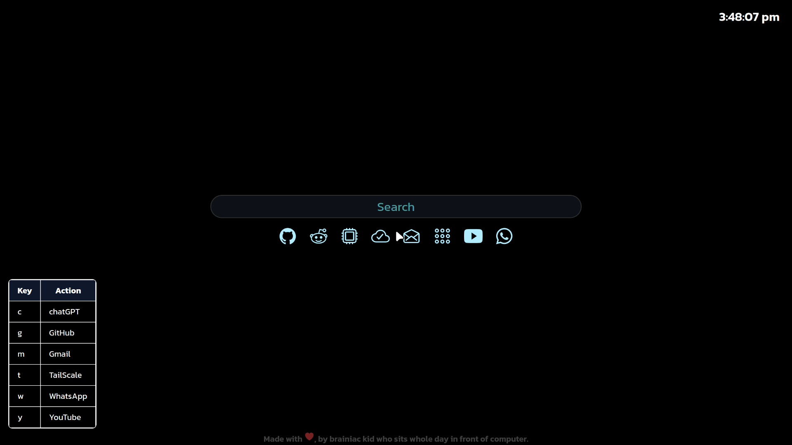

<h1 align="center">Minimal-StartPage</h1>

 Minimalistic start page for chrome.  
 Uses only dark theme.

---

<h2 align="center"><a href="/Installation.md"> Installation </a> | <a href=""> Website </a></h2>

---

<table>	
	<tr>
		<td align="center">
					
				 	
			   
</table>

 

<h3>Key Bindings</h3>

| KEY | ACTION    |
| --- | --------- |
| g   | GitHub    |
| t   | TailScale |
| y   | YouTube   |
| m   | GMail     |
| c   | ChatGPT   |

